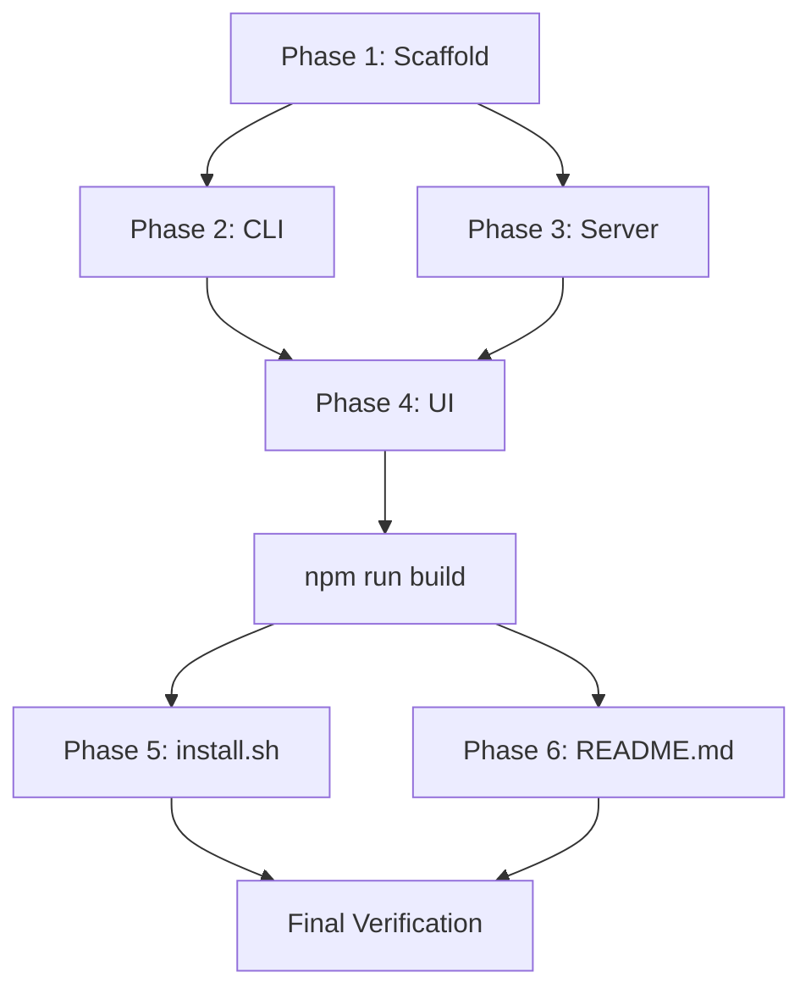

# oro Implementation Plan

## Plan Comparison

Three plans were evaluated. All agree on file inventory, build order, and core architecture. Key differences:

| Decision | Plan 1 (Claude) | Plan 2 (GPT-5) | Plan 3 (Gemini) | **Chosen** |
|---|---|---|---|---|
| Source layout | `oro/cli/`, `oro/server/`, `oro/ui/` | Same | `src/cli/`, `src/server/` | **Plans 1+2** (matches spec) |
| Templates | Physical files in `oro/` | Physical + shared lib | Separate `templates/` dir | **Plan 1** (simplest, matches spec) |
| Vite outDir | `../../dist/server/static` | Same | `../dist/ui` | **Plans 1+2** (correct for compiled server) |
| POST /api/run | Server spawns `bash run.sh` | Server spawns CLI `run` cmd | CLI spawn | **Plan 2** (avoids duplicating lock logic) |
| Root discovery | `process.cwd()` based | Walk-upward search | `process.cwd()` based | **Plan 1** (simpler; walk-upward is premature) |
| Interactive prompts | Node `readline` | `@inquirer/prompts` | Unspecified | **Plan 1** (no extra dep) |
| Preflight checks | Only in `run.sh` | Per-script minimal checks | Only in `run.sh` | **Plan 1** (single entry point) |
| Topbar component | Explicit `Topbar.tsx` | Inline in App | Not specified | **Plan 1** (cleaner separation) |

---

## Phase 1: Project Scaffold

### 1.1 Root config files

| File | Notes |
|---|---|
| `package.json` | Per SPECS.md section 5. bin: `"oro": "./dist/cli/index.js"` |
| `tsconfig.json` | Base: `target: ES2022`, `module: Node16`, `strict: true`, `outDir: dist`, `rootDir: .` |
| `tsconfig.server.json` | Extends base. `include: ["oro/server/**/*"]`, `outDir: dist/server` |
| `tsconfig.cli.json` | Extends base. `include: ["oro/cli/**/*"]`, `outDir: dist/cli` |
| `.gitignore` | Standard Node + oro-specific from SPECS.md section 6, plus `.env.oro`, `oro/server/static/` |
| `LICENSE` | MIT |

**Build scripts in package.json:**
```
"build": "npm run build:server && npm run build:ui && npm run build:cli"
"build:server": "tsc -p tsconfig.server.json"
"build:ui": "cd oro/ui && npx vite build"
"build:cli": "tsc -p tsconfig.cli.json && chmod +x dist/cli/index.js"
"dev": "concurrently \"npm run dev:server\" \"npm run dev:ui\""
"dev:server": "tsx watch oro/server/index.ts"
"dev:ui": "cd oro/ui && npx vite"
```

### 1.2 Prompt files (`oro/prompts/`)

6 files, content verbatim from WORKFLOW.md:
- `scan_file.md`, `update_wiki_index.md`, `analyze.md`, `orchestrate.md`, `execute.md`, `push_pr.md`

### 1.3 Shell scripts (`oro/scripts/`)

7 files from WORKFLOW.md, all `chmod +x`:
- `run.sh`, `scan.sh`, `analyze.sh`, `orchestrate.sh`, `execute.sh`, `update_wiki.sh`, `push_pr.sh`

### 1.4 OpenCode config + AGENTS

- `oro/opencode.json` -- content from root `opencode.json`
- `oro/AGENTS.md` -- content from root `AGENTS.md`

### 1.5 Config template

- `oro/config.template.json` -- per ARCHITECTURE.md section 8

### 1.6 Verification
- `bash -n oro/scripts/*.sh` passes for all 7 scripts
- All prompt files are non-empty
- `oro/opencode.json` is valid JSON

---

## Phase 2: CLI (`oro/cli/`)

### 2.1 Utilities

**`oro/cli/utils/paths.ts`**
- `getProjectRoot()` -- `process.cwd()`
- `getOroDir()` -- `path.join(getProjectRoot(), 'oro')`
- `getPackageRoot()` -- `path.resolve(__dirname, '..', '..')` (from `dist/cli/`)
- `getTodayDate()` -- `YYYY-MM-DD` format
- `getLogDir(date?)` -- `oro/logs/{date}`

**`oro/cli/utils/env.ts`**
- `loadEnv()` -- read `.env.oro`, parse `KEY=VALUE`, set on `process.env`
- `resolveConfigValue(val)` -- if starts with `$`, resolve from `process.env`

**`oro/cli/utils/output.ts`**
- `info()`, `success()`, `warn()`, `error()` -- colored terminal output
- `table()` -- simple aligned table output

### 2.2 Entry point (`oro/cli/index.ts`)
- `#!/usr/bin/env node` shebang
- Commander program with all 8 commands registered
- Version from `package.json`

### 2.3 Commands

| Command | File | Key logic |
|---|---|---|
| `init` | `commands/init.ts` | Create dirs, copy templates (prompts/scripts), interactive readline prompts for API key + GitHub token, write `.env.oro`, write `config.json`, update `.gitignore`, optional cron setup |
| `run` | `commands/run.ts` | Check/write lock file (`oro/logs/.lock` with timestamp), detect stale lock (>4h), load env, spawn `bash oro/scripts/run.sh` with stdio inherit, clean lock on exit/error |
| `scan` | `commands/scan.ts` | Spawn `bash oro/scripts/scan.sh` |
| `status` | `commands/status.ts` | Read `.current_state`, list today's log files, read last execution reports for success/fail counts |
| `logs` | `commands/logs.ts` | List dates, list files for a date, render markdown file with basic ANSI formatting |
| `ui` | `commands/ui.ts` | Check port 7070 with net.connect, start `node dist/server/index.js` if not running (detached, write PID to `oro/logs/.server.pid`), open browser |
| `schedule` | `commands/schedule.ts` | Read/write `config.json` schedule section, update system crontab via `crontab -l` + pipe |
| `config` | `commands/config.ts` | Print config (mask secrets: show `$ENV_VAR` not resolved value) |

### 2.4 Verification
- `tsc -p tsconfig.cli.json` compiles without errors
- `node dist/cli/index.js --version` prints version
- `node dist/cli/index.js --help` shows all 8 commands

---

## Phase 3: Server (`oro/server/`)

### 3.1 Types (`oro/server/types.ts`)
- `RunState` union type (IDLE, SCANNING, ANALYZING, etc.)
- `LogDate` interface
- `WikiIndex`, `WikiFile` interfaces

### 3.2 Server (`oro/server/index.ts`)
Express app on port `process.env.ORO_PORT || 7070`:

| Route | Method | Response |
|---|---|---|
| `/api/logs` | GET | `{ dates: [{ date, files, state }] }` -- sorted newest first |
| `/api/logs/:date/:file` | GET | `{ content, html }` -- raw MD + rendered HTML. Validate `:date` matches `YYYY-MM-DD`, `:file` matches `[\w.-]+\.md` |
| `/api/status` | GET | `{ state, timestamp }` from `.current_state` |
| `/api/wiki` | GET | Parsed `index.json` or `{ files: [], generated_at: null }` |
| `/api/wiki/:filename` | GET | `{ content, html }` from `wiki/files/:filename` |
| `/api/events` | GET | SSE: watch `.current_state` and `latest.log`, emit `state` + `ping` events |
| `/api/run` | POST | Spawn `node dist/cli/index.js run` detached, return `{ started: true }`. Check lock first. |
| `*` | GET | Serve `static/index.html` (SPA fallback) |

Security: validate path params to prevent traversal. All file reads scoped to `oro/` directory.

### 3.3 Verification
- `tsc -p tsconfig.server.json` compiles without errors
- Server starts and returns `{"dates":[]}` from `GET /api/logs`

---

## Phase 4: UI (`oro/ui/`)

### 4.1 Config

**`oro/ui/vite.config.ts`**
- React plugin
- `root: '.'` (oro/ui/ is the root via `cd`)
- `outDir: '../../dist/server/static'` (critical: matches compiled server path)
- `emptyOutDir: true`
- Dev proxy: `/api` -> `http://localhost:7070`

**`oro/ui/tsconfig.json`**
- Standalone, does not extend base (Vite handles TS)
- `jsx: react-jsx`, `module: ESNext`, `target: ES2020`

**`oro/ui/index.html`**
- Google Fonts: DM Serif Display
- `<div id="root">` mount point

### 4.2 Styles

**`oro/ui/src/styles/vars.css`** -- all CSS variables from SPECS.md section 4.3
**`oro/ui/src/styles/global.css`** -- reset, body bg/color/font, scrollbar styling

### 4.3 Types (`oro/ui/src/types.ts`)
- `RunState`, `LogDate`, `WikiIndex`, `WikiFile` (structurally duplicated from server, no cross-import)

### 4.4 Components

| Component | Key features |
|---|---|
| `App.tsx` | Root layout, state management (selectedDate/File, wikiOpen), keyboard shortcuts (Cmd+B sidebar, Escape close wiki) |
| `Topbar.tsx` | 48px fixed. Logo left, RunStatus center-right, wiki toggle + "Run Now" button right |
| `Sidebar.tsx` | 240px fixed. Date groups collapsible with chevron. File items mapped to phase labels. Active item left-border accent. "Wiki" link at bottom |
| `LogViewer.tsx` | Flex-grow main area. Renders markdown via `marked` + `highlight.js`. Sticky mini-header (phase + date). Empty/loading states |
| `RunStatus.tsx` | Pill with state label + color. CSS pulse animation when running. Click opens popover with last 20 lines of latest.log |
| `WikiBrowser.tsx` | 320px right panel, toggleable. Search filter, file list, quality issues summary table. Click file shows wiki entry in LogViewer |

### 4.5 Hooks

| Hook | Purpose |
|---|---|
| `useLogs()` | Fetch `GET /api/logs`, return `{ dates, isLoading, error, refetch }`. Auto-refetch on SSE idle transition |
| `useSSE()` | EventSource to `/api/events`. Return `{ state, isRunning, lastEvent }`. Auto-reconnect on disconnect |
| `useLogContent(date, file)` | Fetch `GET /api/logs/:date/:file` on change. Return `{ content, html, isLoading, error }` |

### 4.6 Phase label mapping utility
```
00-scan.md -> "Scan"
01-analysis.md -> "Analysis"
02-plan.md -> "Plan"
03-orchestration.md -> "Orchestration"
04-execution-N.md -> "Executor N"
05-wiki-update.md -> "Wiki Update"
06-pr.md -> "Pull Request"
```

### 4.7 Verification
- `cd oro/ui && npx vite build` succeeds, output in `dist/server/static/`
- Built HTML/JS/CSS files exist

---

## Phase 5: Installer (`install.sh`)

Root-level script per SPECS.md section 1:

1. Print logo
2. Check Node >= 18 (`node --version`)
3. Check Git >= 2.30 (`git --version`)
4. Check/install `opencode` CLI
5. Check `gh` CLI (warn if missing, non-fatal)
6. Clone or update `~/.oro/`
7. `npm install && npm run build` in `~/.oro/`
8. Add `~/.oro/bin/` to PATH in `.bashrc` + `.zshrc`
9. Create symlink `~/.oro/bin/oro` -> `~/.oro/dist/cli/index.js`
10. Run `oro init` in current directory
11. Print success + quick start

Key properties: idempotent, non-destructive, colored output, informative progress.

### Verification
- `bash -n install.sh` passes

---

## Phase 6: README.md

Per PLAN.md section 6:
1. Project description + philosophy
2. ASCII architecture diagram (3-model workflow)
3. One-liner install command
4. Quick start (5 commands)
5. Configuration reference
6. Model cost table
7. FAQ (4 items)
8. Contributing guide
9. MIT License reference

---

## Build & Verification Sequence



### Final Verification Checklist
1. `npm run build` succeeds (server -> UI -> CLI)
2. `bash -n oro/scripts/*.sh` -- all 7 scripts pass
3. `node dist/cli/index.js --version` prints version
4. `node dist/cli/index.js --help` shows all commands
5. `node dist/server/index.js` starts on 7070, `GET /api/logs` returns `{"dates":[]}`
6. All 6 prompt files exist and are non-empty
7. `oro/opencode.json` is valid JSON
8. `bash -n install.sh` passes

---

## Key Decisions & Constraints

- **No cross-tsconfig imports**: Server types and UI types are structurally duplicated
- **Physical template files**: Prompts and scripts ship as files, copied by `init`
- **Secrets in `.env.oro`**: Never committed, resolved at runtime by CLI
- **Server spawns CLI for runs**: `POST /api/run` invokes `node dist/cli/index.js run` to reuse lock/env logic
- **Vite outDir correction**: Must be `../../dist/server/static` (not `../server/static` as in SPECS)
- **No database, no auth**: Filesystem-only, localhost-only
